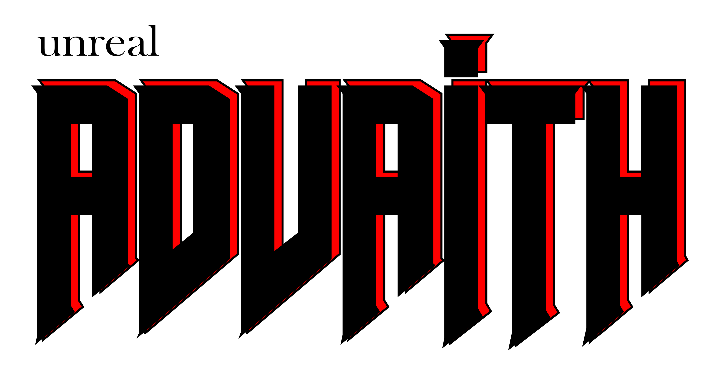

## About Me

I'm Advaith. I'm a technologist focused on Remote Sensing, Deep Learning, and Spatial data. Never did I as a child think I'd say that I'm a technologist who is into Computer Science and Remote Sensing. Anyways, here I am, loving what I do, loving who I am.

### More About Me, 'cause why not.

I'm from Kerala, I work at some place in Delhi, I've studied in Dehradun, I've worked for a bit at Hyderabad. I'm not fond of travelling, I like video games and badminton.

---

## Things I Know

- Remote Sensing & GIS, Satellite Image Analysis.
- Deep Learning, Machine Learning, AI.
- Scripting (Python, Bash, Other Languages, kinda language Agnostic at this point).
- Web (React, Django – support skill).
- Everything else under the sun.

---

## Professional Qualifications

- *Geospatial Developer*, Silver Touch Technologies. (July 2025 -- *Present*)
  - Solving problems in the geospatial domain, through efficient, scalable code.
  - Applying the power of mathematics to intelligently extract information from real world data.
- *Project Intern*, INAI, IIIT-H (October 2022 -- March 2024)
  - I worked on ML Projects.
  - I automated some data processing workflows and created a dashboard.
- *Intern*, Six30 Labs (June 2022 -- July 2022)
  - I worked on developing an Intruder Detection system.
  - Worked with Computer Vision tasks

---

## Educational Qualifications

- **Master of Technology in Remote Sensing & GIS** _Specializing in Satellite Image Analysis and Photogrammetry_, Indian Institute of Remote Sensing (Indian Space Research Organization), Dehradun (2023–2025)  
- **Bachelor of Technology in Computer Science**, Cochin University of Science and Technology (2019–2023)

---

## Projects

**M.Tech Thesis** – Deep Learning-based LULC Change Detection using Multi-Sensor Data
- Used Sentinel-1, Sentinel-2, indices, and DEM with deep learning and SHAP for explainability.

**B.Tech Final Project** – Rigging-free Voting System
- Secure architecture using blockchain-like concepts to prevent manipulation.

**Mini Project** – Text Summarization with Self-Organizing Maps  
- Implemented and evaluated unsupervised models for extractive summarization.

---

## Publications

### Deep Learning Based Land Use Land Cover Classification on Multi-Sensor Remote Sensing Data

**Advaith C A**, S. Agrawal, V. Kumar, S. Kumar, P. S. Tiwari  
*ISPRS Annals of the Photogrammetry, Remote Sensing and Spatial Information Sciences*,  
Volume **X-5/W2-2025**, 2025, pp. 7–14  

🔗 [Paper](https://isprs-annals.copernicus.org/articles/X-5-W2-2025/7/2025/)  
📄 DOI: [10.5194/isprs-annals-X-5-W2-2025-7-2025](https://doi.org/10.5194/isprs-annals-X-5-W2-2025-7-2025)

### A Spectrophotometric Evaluation of Lunar Catharina Crater Using Support Vector Regression Analysis for FeO and TiO₂ Estimations

Padinharethodi A. K., Kumar S., **Advaith C A**  
*ISPRS Annals of the Photogrammetry, Remote Sensing and Spatial Information Sciences*,  
Volume **X-G-2025**, 2025, pp. 607–612  

🔗 [Paper](https://isprs-annals.copernicus.org/articles/X-G-2025/607/2025/)  
📄 DOI: [10.5194/isprs-annals-X-G-2025-607-2025](https://doi.org/10.5194/isprs-annals-X-G-2025-607-2025)

### Design and Implementation of an Efficient Text Summarization Method Using Self-Organizing Maps

Asha Raj, Sudheep Elayidom M, Abhinav T B, **Advaith C A**, Amrutha Dinesh  
*International Journal of Advance Computational Engineering and Networking (IJACEN)*,  
Volume **10**, Issue **10**, 2022, pp. 48–53  

🔗 [Paper](https://www.iraj.in/journal/journal_file/journal_pdf/3-864-167214292148-53.pdf)  

---

## Unofficial Collaborations

I’ve contributed to projects across diverse domains such as Marine Sciences, Geosciences, Agriculture, and Forestry. These included:

- Automating graphing and GPS data cleaning
- Interpreting radiative transfer model pipelines (R), hyperspectral fusion pipelines (Python)
- Co-registration of multi-sensor imagery
- DEM generation using satellite LiDAR + deep learning (GANs)
- Fusion of spy satellite, SAR, DEM, and optical imagery
- Assisted peers out of curiosity and technical passion — not for academic credit (*Though It has been acknowledged by a grateful few.*)

*I've also worked in one project as a freelancer, It did not end well, Taught me a lot about boundaries, ethics and burnout. Yeah, I need to work on being diplomatic*

---

## Hackathons, Presentations & Events

**GIFTS Summit 2025**, Symbiosis International University (2025)  
🏆 *Oral Presentation* – Presented my research on the topic **Deep Learning based Land Use Land Cover classification on Multi-Sensor Remote Sensing Data**.  
Organized by Symbiosis International University, Lavale.  

**IEEE GRSS Science Day Hackathon**, IIT Indore (2025)  
🏆 *First Runner-Up* – Problem Statement PS3: Coregistration of Multispectral Imagery  
Participated as part of team *Reality Warpers*.  
Organized by IEEE GRSS SBC, IIT Indore, in collaboration with IEEE GRSS MP Chapter.  

**Mapathon 2024**, IIRS & Indian Society of Remote Sensing (Nov 2024)  
Mapped change detection in a small region of Delhi using medium-resolution imagery.  
Applied LSTM to attempt prediction of future land use transitions.

**Mapathon 2024**, Chandigarh University (Oct 2024)  
Created maps for Boragaon waste disposal site using remote sensing to track LULC change.

**Warpspeed by Lightspeed**, Devfolio (May 2023)  
Offline Generative AI Hackathon. Developed a web app for generating 3D primitive-based scenes rendered into high-quality 2D visuals.

**Pygames Hackathon**, Devpost (Apr 2023)  
🏆 *Winner* – Among the first 20 eligible non-US/Canada participants ($50 prize).  
Created a Pong-style game with creative twists using Pygame.

**Starlet Hackathon**, Mind Empowered (Feb 2023)  
🧠 *Mentor* – Guided 10+ teams during a gender-diverse tech hackathon.  
Helped with idea implementation, tech support, and collaboration.

**Intro Session on AI & ML** (Dec 2022)  
Delivered an introductory class on AI & ML to 77 students from multiple branches.  
Received positive feedback across the board.

**VIGYAAN 2022**, Naipunnya Institute (Nov 2022)  
Presented a paper on *Analysis and Evaluation of Neural Style Transfer* at the International Conference on Advanced and Emerging Trends in CS.

## Awards & National Exams

**GATE – Geomatics Engineering (GE)**  
Qualified in 2025 with a score of 648 and **AIR 46**

**GATE – Computer Science (CS)**  
Qualified in:
- 2025: Score 381; Rank 17,015  
- 2023: Score 356; Rank 10,159

**Taramandala National Science Talent Search Examination**  
National Rank: **4**

---

## Connect With Me

🔗 [Website](https://www.advaithca.com) • 
📧 [Email](mailto:advaith29042002@gmail.com) • 
💻 [GitHub](https://github.com/advaithca) • 
💼 [LinkedIn](https://www.linkedin.com/in/advaith-ca)